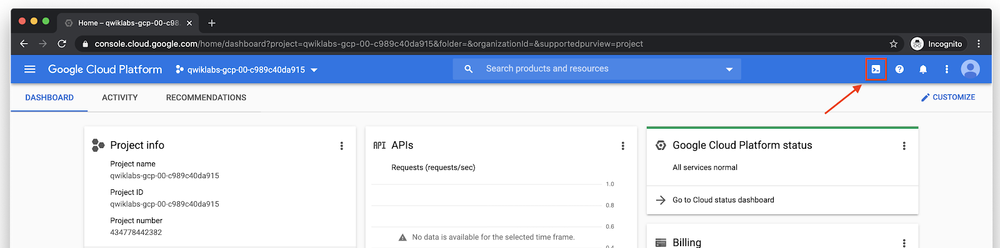
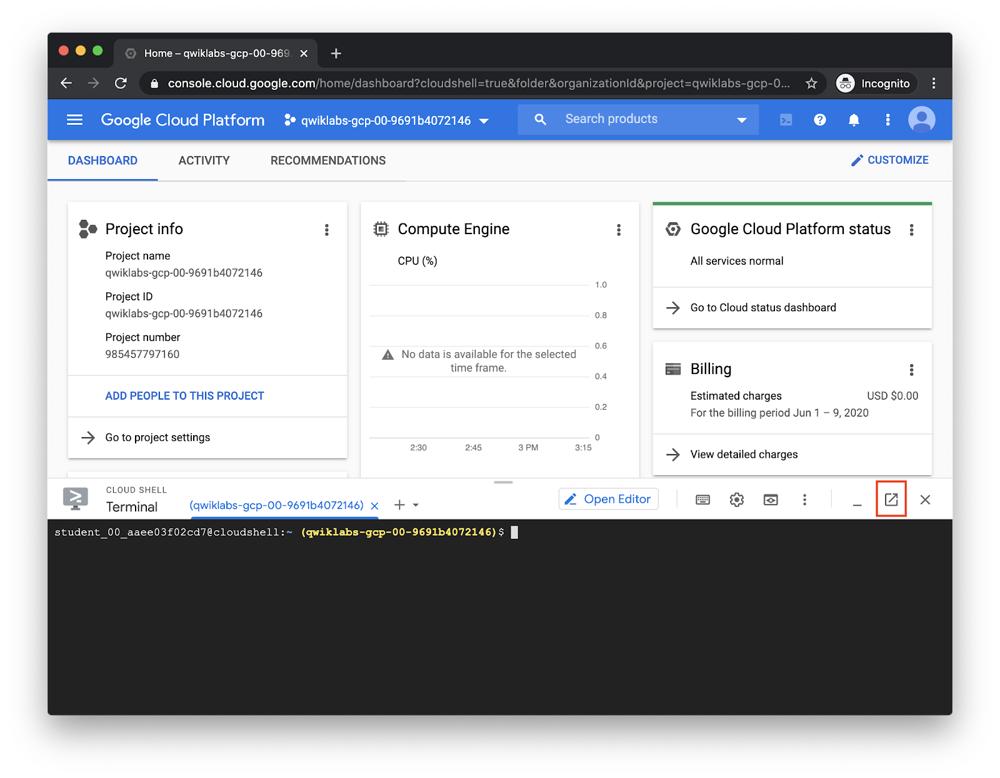
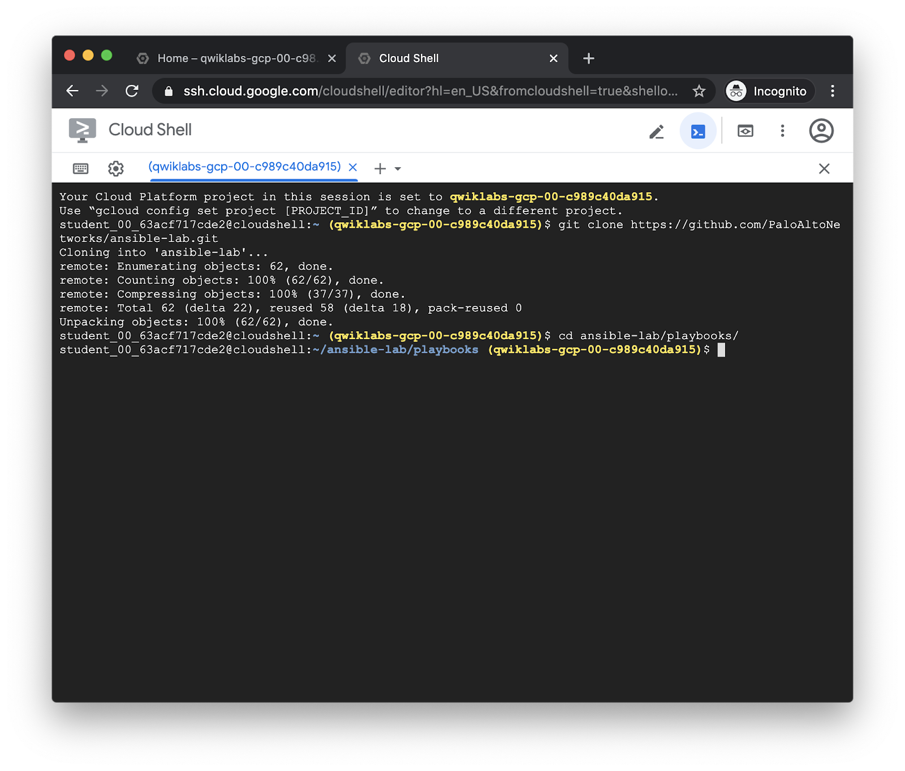
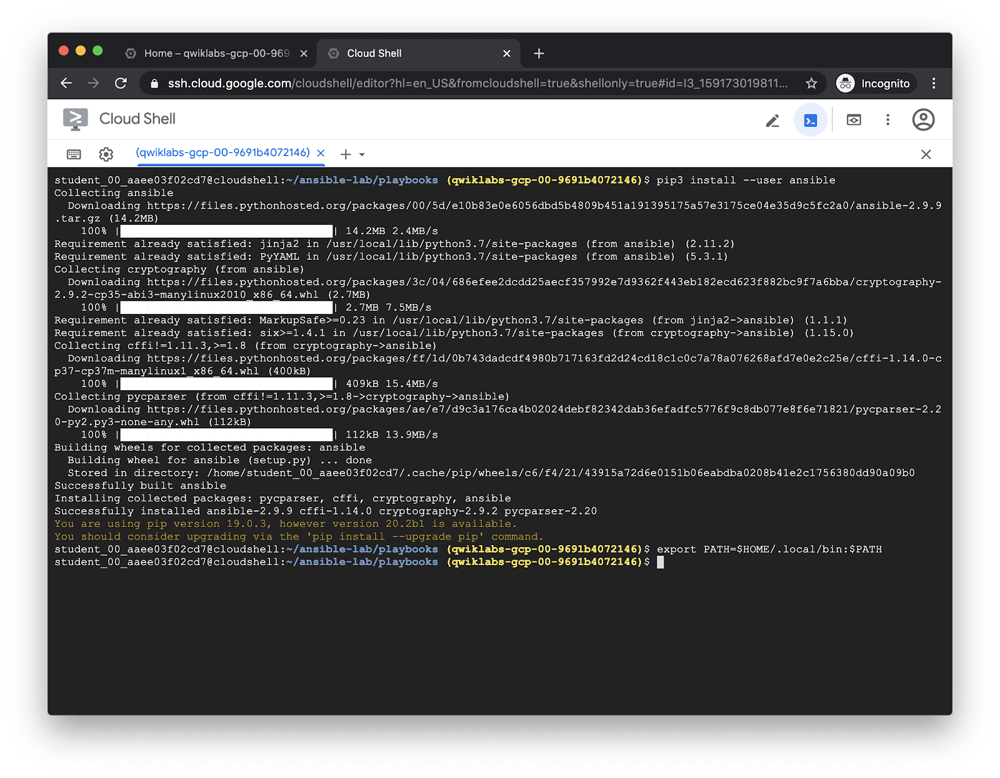
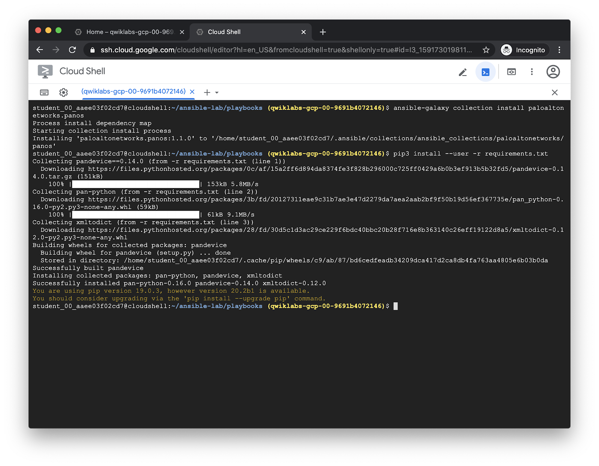
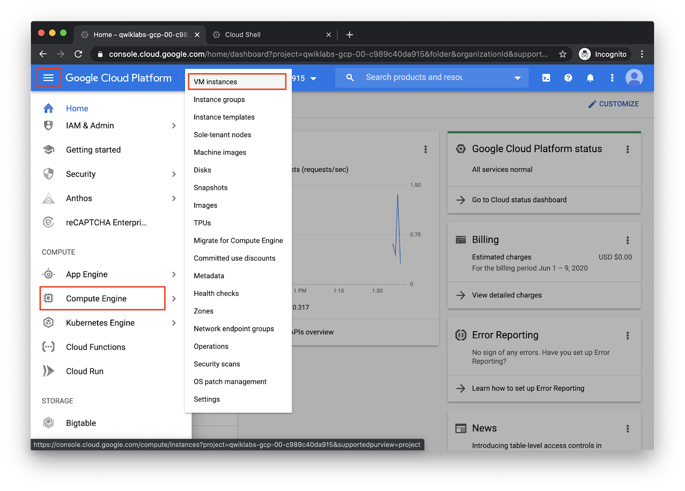
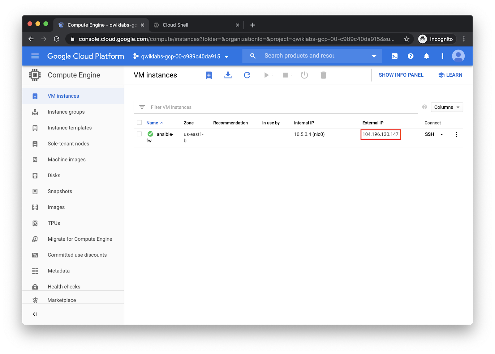
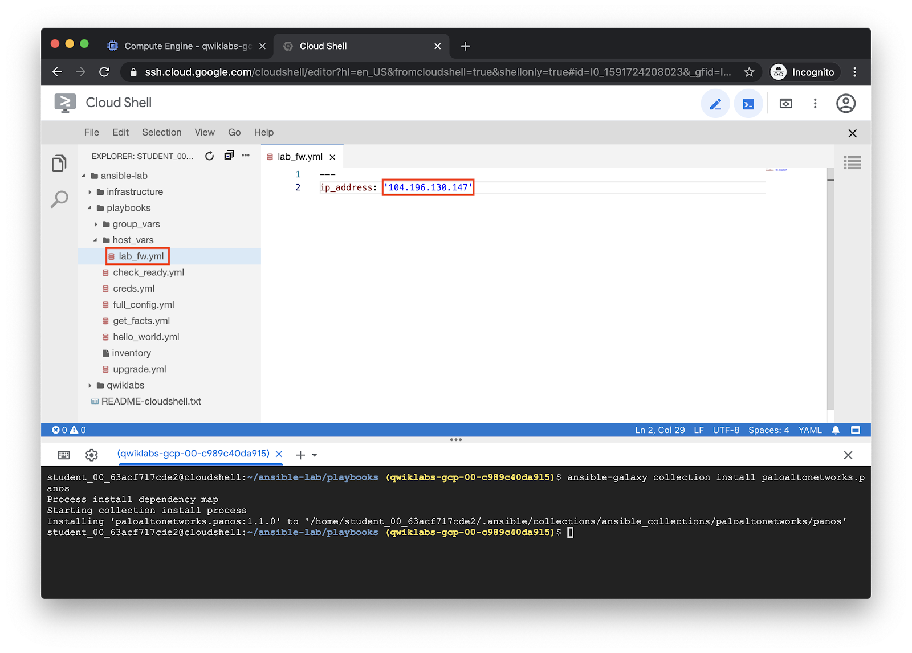
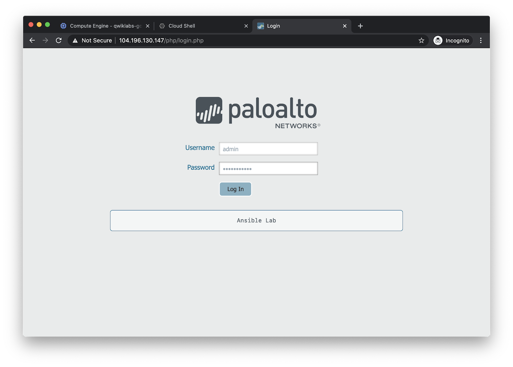
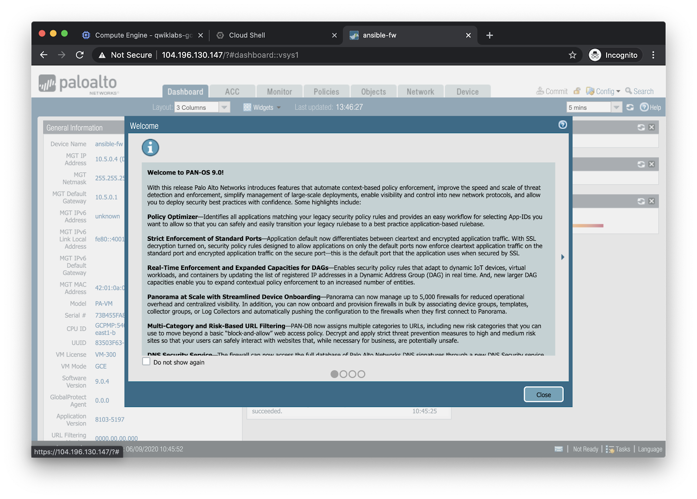

===============
Getting Started
===============

In your created GCP project, click the Cloud Shell button in the top right
corner.  This will launch a shell session in a persistent container, giving you
full shell access for your project.  It also comes with a number of useful
tools pre-installed.  Using Cloud Shell for this lab ensures firewalls or VPNs
won't prevent access to the management interface of your lab firewall.

You can also click the **Open in new window** icon to make Cloud Shell take an
entire browser tab.

Clone the repository containing our sample playbooks from GitHub, and change
into the playbooks directory:

.. code-block:: bash

   git clone https://github.com/PaloAltoNetworks/ansible-lab.git
   cd ansible-lab/playbooks

Ansible does not come installed by default in the Cloud Shell environment, so
install it and add it to your shell's PATH.

.. code-block:: bash

   pip3 install --user ansible
   export PATH=$HOME/.local/bin:$PATH

Now, install the latest version of the PAN-OS Ansible collection from Ansible
Galaxy, and the Python libraries it depends on.

.. code-block:: bash

   ansible-galaxy collection install paloaltonetworks.panos
   pip3 install --user -r requirements.txt

Now, you’ll need to modify the IP address in ``host_vars/lab-fw.yml`` to match the
management interface of the VM-Series that was launched for you in GCP.  In the
GCP console, click on **Menu > Compute Engine > VM instances**.

The **External IP** of the launched instance is the management interface IP
address.

In your Cloud Shell tab, click the pencil icon to launch the Cloud Shell
Editor.  Navigate to the file ``ansible-lab/playbooks/host_vars/lab-fw.yml``,
and replace the ip_address value with the IP address of your VM-Series.

Log in to the firewall web UI using the following credentials.  It could take
up to 10 minutes for the firewall to be fully booted.

Username:
  ``admin``

Password:
  ``Ignite2020!``

We'll use the web UI to observe the changes we make to the firewall using
Ansible.

