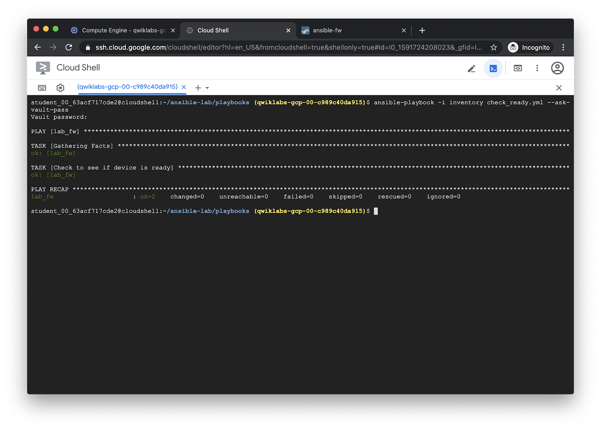
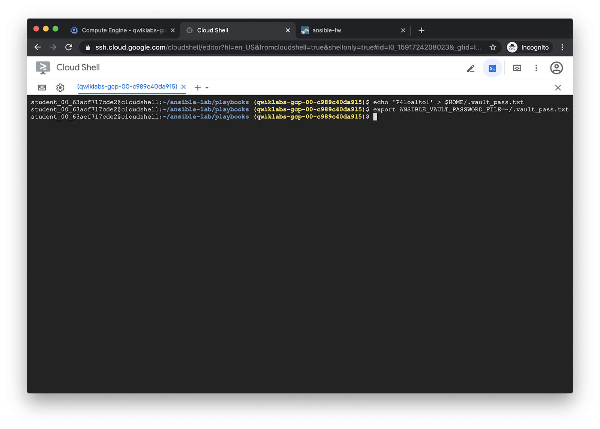
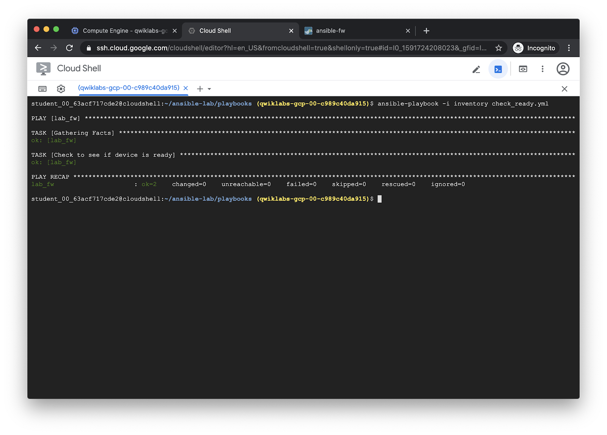

============================
Run the Check Ready playbook
============================

The ``check_ready.yml`` playbook will loop until the firewall is fully booted
and able to pass traffic:

.. literalinclude:: ../../playbooks/check_ready.yml

Run the playbook with ``ansible-playbook``:

.. code-block:: bash

   ansible-playbook -i inventory check_ready.yml --ask-vault-pass

The file ``creds.yml`` contains the username and password for the firewall, but
it is encrypted with ansible-vault.  The ``--ask-vault-pass`` option will prompt
us for the password to decrypt them.  Use the following vault password for each
playbook run:

.. code-block:: none

   P4loalto!

ansible-vault will then decrypt the credentials stored in ``creds.yml`` and
supply them to the playbook run.

Output:

Optional: Avoid typing vault password each time
===============================================

You will have to type the vault password each time you want to decrypt
``creds.yml``.  If you get tired of that, create a file in your home directory
called ``.vault_pass.txt`` containing just the vault password, and then export
the ``ANSIBLE_VAULT_PASSWORD_FILE`` environment variable:

.. code-block:: bash

   echo ‘P4loalto!’ > $HOME/.vault_pass.txt
   export ANSIBLE_VAULT_PASSWORD_FILE=~/.vault_pass.txt

Now, you can leave the ``--ask-vault-pass`` option off of the
``ansible-playbook`` commands, and the credentials will be decrypted
transparently each time.

