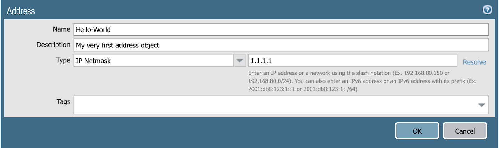
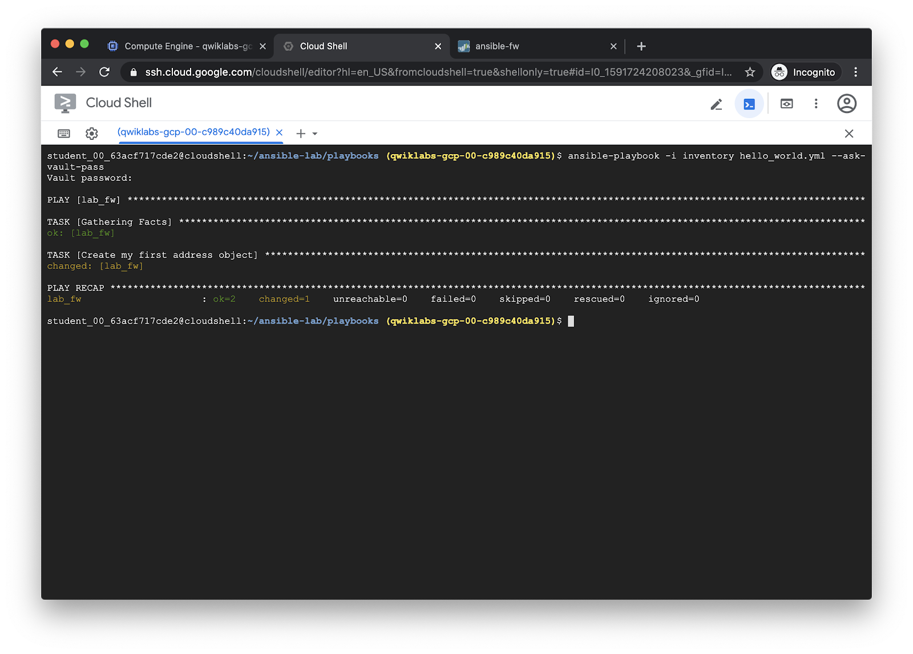

============================
Run the Hello World playbook
============================

The ``hello_world.yml`` playbook will create an address object:

.. literalinclude:: ../../playbooks/hello_world.yml

For more information, see the `panos_address_object module documentation <https://ansible-pan.readthedocs.io/en/latest/modules/panos_address_object_module.html>`_.

Run the playbook with ``ansible-playbook``:

.. code-block:: bash

   ansible-playbook -i inventory hello_world.yml --ask-vault-pass

Output:

