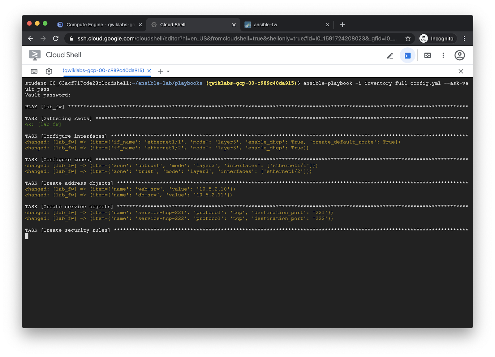
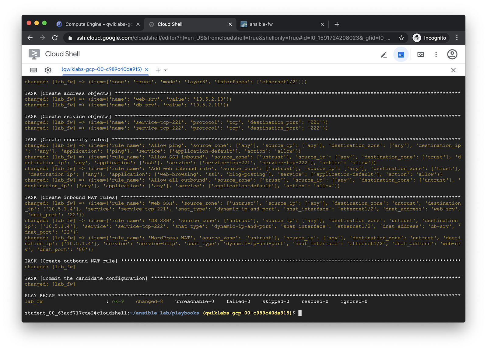

============================
Run the Full Config playbook
============================

The `full_config.yml <https://github.com/PaloAltoNetworks/ansible-lab/blob/master/playbooks/full_config.yml>`_
playbook will create a full PAN-OS configuration using several different
modules, then commits the configuration.  For more information, see the
documentation pages for the modules used:

- `panos_interface <https://paloaltonetworks.github.io/pan-os-ansible/modules/panos_interface.html>`_
- `panos_zone <https://paloaltonetworks.github.io/pan-os-ansible/modules/panos_zone.html>`_
- `panos_address_object <https://paloaltonetworks.github.io/pan-os-ansible/modules/panos_address_object.html>`_
- `panos_service_object <https://paloaltonetworks.github.io/pan-os-ansible/modules/panos_service_object.html>`_
- `panos_security_rule <https://paloaltonetworks.github.io/pan-os-ansible/modules/panos_security_rule.html>`_
- `panos_nat_rule <https://paloaltonetworks.github.io/pan-os-ansible/modules/panos_nat_rule.html>`_
- `panos_commit <https://paloaltonetworks.github.io/pan-os-ansible/modules/panos_commit.html>`_

.. code-block:: bash

   ansible-playbook -i inventory full_config.yml --ask-vault-pass

