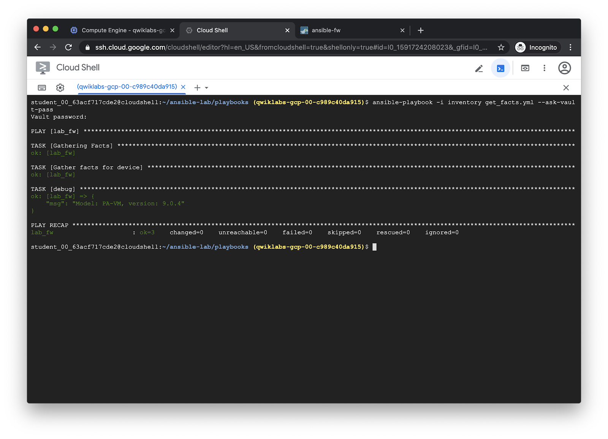

==========================
Run the Get Facts playbook
==========================

The ``get_facts.yml`` playbook fetches the model type and software version from
a PAN-OS device and prints it out to the screen.  To see the different types of
information you can retrieve, see the `panos_facts module documentation <https://paloaltonetworks.github.io/pan-os-ansible/modules/panos_facts.html>`_.

.. literalinclude:: ../../playbooks/get_facts.yml

Run the playbook with ``ansible-playbook``:

.. code-block:: bash

   ansible-playbook -i inventory get_facts.yml  --ask-vault-pass

Output:

